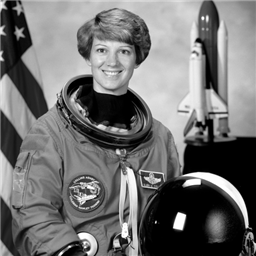
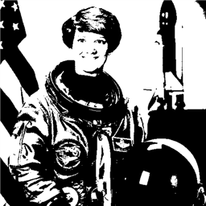
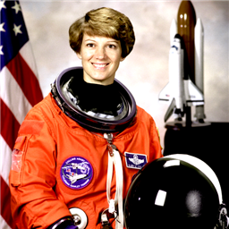
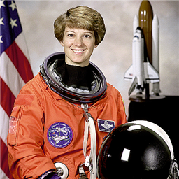
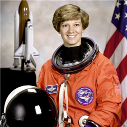
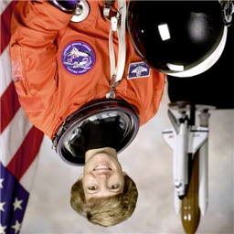
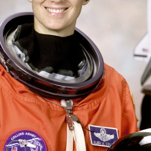
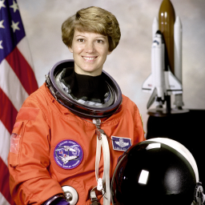
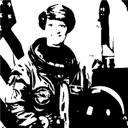
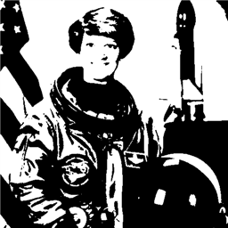

# GLIM_MACHINE_VISION_SW_RESULT
그림의 이차전지 머신비전 소프트웨어 엔지니어(SW) 채용을 위한 공간입니다.

---

# ImageProcessor

BMP 이미지 파일을 입력으로 받아 흑백 변환, 밝기/대비 조절, 이진화, 블러/샤픈, 히스토그램 분석, 크롭/리사이즈, 상하좌우 반전을 적용한 뒤 새 BMP 파일로 저장하는 커맨드라인 프로그램입니다.

## 예시 결과

같은 사진 한 장에 열두 가지 기능을 적용한 결과입니다.

<table>
<tr>
<td align="center"><br><sub>원본</sub></td>
<td align="center"><br><sub>grayscale</sub></td>
<td align="center"><br><sub>threshold:128</sub></td>
<td align="center"><br><sub>brightness:30</sub></td>
</tr>
<tr>
<td align="center"><br><sub>contrast:1.5</sub></td>
<td align="center"><br><sub>blur</sub></td>
<td align="center"><br><sub>sharpen</sub></td>
<td align="center"><br><sub>horizontal</sub></td>
</tr>
<tr>
<td align="center"><br><sub>vertical</sub></td>
<td align="center"><br><sub>crop</sub></td>
<td align="center"><br><sub>resize</sub></td>
<td align="center"><br><sub>blur + threshold</sub></td>
</tr>
</table>

<br>
<sub>파이프라인 grayscale → blur → threshold:128 (필터를 순서대로 이어 붙인 것)</sub>

## 빠른 시작

`ImageProcessor.sln`을 Visual Studio 2022에서 열어 x64/Release로 빌드한 뒤, 저장소 폴더에서 바로 실행할 수 있습니다.

```powershell
.\x64\Release\ImageProcessor.exe --input .\Resource\1_astronaut.bmp --output result1.bmp --filter grayscale
.\x64\Release\ImageProcessor.exe --input .\Resource\1_astronaut.bmp --output result2.bmp --filter blur --threshold 128
.\x64\Release\ImageProcessor.exe --input .\Resource\1_astronaut.bmp --output result3.bmp --pipeline "grayscale,blur,threshold:128"
```

## 빌드 방법

Visual Studio 2022(플랫폼 도구 집합 v143), C++17 이상이 필요합니다. `ImageProcessor.sln`을 열고 구성을 x64/Release로 맞춘 다음 빌드하면 됩니다.

PowerShell에서 직접 빌드하려면 아래처럼 합니다. 설치한 Visual Studio 에디션에 따라 경로(`Community` 부분)가 다를 수 있습니다.

```powershell
& "C:\Program Files\Microsoft Visual Studio\2022\Community\MSBuild\Current\Bin\MSBuild.exe" ImageProcessor.sln /p:Configuration=Release /p:Platform=x64
```

빌드가 끝나면 `x64\Release\ImageProcessor.exe`가 만들어집니다.

## 사용법

세 가지 방식을 지원합니다.

```powershell
# 1) 필터를 하나만 적용
.\x64\Release\ImageProcessor.exe --input input.bmp --output result.bmp --filter grayscale

# 2) 필터 하나 + 임계값 (blur를 적용한 다음, 그 결과를 128 기준으로 이진화합니다. 두 단계가 순서대로 일어납니다)
.\x64\Release\ImageProcessor.exe --input input.bmp --output result.bmp --filter blur --threshold 128

# 3) 필터 여러 개를 순서대로 이어 붙임 (파이프라인)
.\x64\Release\ImageProcessor.exe --input input.bmp --output result.bmp --pipeline "grayscale,blur,threshold:128"
```

### 옵션

| 옵션 | 설명 |
|---|---|
| `-i, --input <경로>` | 입력 BMP 파일(24비트, 압축 없는 형식) |
| `-o, --output <경로>` | 결과를 저장할 BMP 파일 경로 |
| `-f, --filter <토큰>` | 적용할 필터 하나 (예: `grayscale`, `threshold:128`) |
| `-t, --threshold <0~255>` | 임계값. `--filter`와 같이 써야 하고, `--pipeline`과는 같이 쓸 수 없습니다 |
| `-p, --pipeline <토큰들>` | 필터를 쉼표로 이어 붙인 목록 (예: `"grayscale,blur,threshold:128"`) |
| `--threads <N>` | 처리에 쓸 스레드 개수. 안 주면 코어 수만큼 자동으로 씁니다 |
| `-l, --log <경로>` | 실행 기록(시간, 필터별 소요 시간, 오류)을 이 파일에 남깁니다 |
| `-h, --help` | 사용법을 보여줍니다 |

### --threshold를 같이 쓸 때의 규칙

| 입력 | 결과 |
|---|---|
| `-f blur -t 128` | blur, threshold:128 순서로 적용 |
| `-f threshold:100` | threshold:100만 적용 |
| `-f threshold -t 128` | 오류. 임계값을 필터 이름과 `-t` 중 어디서 가져올지 애매합니다 |
| `-f threshold:100 -t 128` | 오류. 임계값을 두 군데서 동시에 주고 있습니다 |
| `-t 128` 단독 | 오류. `--filter`나 `--pipeline` 없이는 쓸 수 없습니다 |
| `-t 128 -p ...` | 오류. `--threshold`와 `--pipeline`은 같이 쓸 수 없습니다 |

## 필터 토큰 형식

필터 이름만 쓰거나 `이름:인자:인자`처럼 콜론으로 인자를 붙입니다. 필터를 이어 붙일 때는 쉼표로 구분합니다.

| 토큰 | 인자 | 설명 |
|---|---|---|
| `grayscale` | 없음 | 흑백으로 변환 |
| `threshold:N` | N(0~255) | 밝기가 N보다 크면 흰색, 작으면 검은색 |
| `brightness:N` | N(-255~255) | 모든 픽셀을 N만큼 더 밝거나 어둡게 |
| `contrast:F` | F(0 이상) | 밝은 곳과 어두운 곳의 차이를 F배로 |
| `horizontal` | 없음 | 좌우 반전 |
| `vertical` | 없음 | 상하 반전 |
| `blur` | 없음 | 흐리게 |
| `sharpen` | 없음 | 경계선을 또렷하게 |
| `hist` | 없음 | 밝기 분포를 화면에 출력. 이미지는 바꾸지 않고 그대로 넘겨줍니다 |
| `crop:x:y:w:h` | 정수 4개 | (x, y)에서 가로 w, 세로 h만큼 잘라냄 |
| `resize:w:h` | 정수 2개 | 가로 w, 세로 h로 크기 변경 |

크기가 바뀌는 필터(`crop`, `resize`, `hist`) 뒤에 다른 필터를 이어 붙일 수 있습니다. 예: `crop:0:0:100:100,grayscale`.

## 히스토그램 출력 예시

`--filter hist`를 실행하면 화면에 이렇게 출력됩니다. 0부터 255까지의 밝기 값을 16개 구간으로 나눠서 각 구간의 픽셀 수를 막대로 보여줍니다.

```
Loaded: 512 x 512
Histogram: min=0 max=255 mean=112.69
[  0- 15] ################################################## (46988)
[ 16- 31] ############ (11526)
[ 32- 47] ################ (15128)
[ 48- 63] ######### (8733)
[ 64- 79] ########## (9605)
[ 80- 95] ########### (10386)
[ 96-111] ############### (14246)
[112-127] ##################### (19998)
[128-143] ###################### (20750)
[144-159] ################ (14693)
[160-175] ################### (18034)
[176-191] ######################### (23386)
[192-207] ########################### (24936)
[208-223] ################ (14951)
[224-239] ##### (4839)
[240-255] #### (3945)
Saved:  result.bmp
```

## 로그 예시

`--log 경로`를 주면 그 파일에 아래처럼 한 줄씩 기록이 남습니다. `--log`를 안 주면 로그 파일을 만들지 않습니다.

```
2026-09-29 15:38:33 [INFO] Loaded .\Resource\1_astronaut.bmp (512x512)
2026-09-29 15:38:33 [INFO] Thread count: 16 (auto)
2026-09-29 15:38:33 [INFO] Filter start: grayscale
2026-09-29 15:38:33 [INFO] Filter end: grayscale (1.424700 ms)
2026-09-29 15:38:33 [INFO] Filter start: blur
2026-09-29 15:38:33 [INFO] Filter end: blur (0.962100 ms)
2026-09-29 15:38:33 [INFO] Filter start: threshold
2026-09-29 15:38:33 [INFO] Filter end: threshold (0.627800 ms)
2026-09-29 15:38:33 [INFO] Saved result.bmp
```

`--threshold 300`처럼 범위를 벗어난 값을 주면 화면에 아래 메시지가 뜨고 종료 코드 4로 끝납니다.

```
[Argument] --threshold must be between 0 and 255 (got 300)
```

## 종료 코드

| 코드 | 의미 |
|---|---|
| 0 | 정상 종료 |
| 1 | 예상하지 못한 오류 |
| 2 | BMP 파일을 읽는 중 문제 발생 (지원하지 않는 형식 등) |
| 3 | 필터 이름이나 인자가 잘못됨 (모르는 필터 이름, crop 범위가 이미지보다 큼 등) |
| 4 | 커맨드라인 인자가 잘못됨 (`--threshold 300`처럼 범위를 벗어난 값 등) |

## 과제 항목별 대응

| 과제 요구 항목 | 구현 위치 |
|---|---|
| 1. 그레이스케일(RGB 가중치) | `ColorUtil.cpp`의 `toLuma` 함수. R, G, B에 각각 다른 비중(0.2126, 0.7152, 0.0722)을 곱해 더하는 BT.709 방식. `GrayscaleFilter.cpp`에서 사용 |
| 2. 밝기/대비(값 범위 유지) | `BrightnessFilter.cpp`, `ContrastFilter.cpp`. 계산 결과를 `std::clamp`로 0~255 안에 유지 |
| 3. 이진화(임계값 파라미터화) | `ThresholdFilter.cpp`. `threshold:N`으로 임계값 지정, `toLuma`로 구한 밝기와 비교 |
| 4. 3x3 컨볼루션 | `BlurFilter.cpp`(주변 칸 평균), `SharpenFilter.cpp`(가운데를 강조하는 커널) |
| 5. 히스토그램 분석 | `Histogram.cpp`. 256개 밝기 구간을 센 뒤 최솟값/최댓값/평균과 16구간 막대그래프를 콘솔에 출력 |
| 6. 크롭/리사이즈 | `CropFilter.cpp`(좌표 계산 후 복사), `ResizeFilter.cpp`(주변 픽셀을 섞는 보간 방식) |
| 7. 상하/좌우 반전 | `FlipHorizontalFilter.cpp`, `FlipVerticalFilter.cpp` |

가산점 항목: `FilterBase` 추상 클래스로 필터를 다형성 있게 다룸(`FilterBase.h`, `FilterFactory.cpp`), 필터 체인(`--pipeline`), 스레드 분산 처리(`TiledFilter.cpp`, `--threads`), 로그 파일(`Logger.cpp`, `--log`).

## 여러 스레드로 나눠 처리하기 (--threads)

필터의 성격에 따라 나눠서 병렬화했습니다.

1. 자기 픽셀 값만 보는 필터(`grayscale`, `threshold`, `brightness`, `contrast`)는 이미지를 가로줄 묶음으로 나눠, 각 스레드가 자기 묶음만 읽고 그 자리에 씁니다.
2. `horizontal`은 한 줄 안에서 좌우만 바꾸므로 줄 단위로, `vertical`은 위아래 줄을 통째로 맞바꿔야 해서 줄 쌍 단위로 나눕니다.
3. `blur`와 `sharpen`은 옆줄까지 봐야 하므로, 원본은 그대로 두고 결과만 새 이미지의 각자 맡은 구간에 씁니다.
4. `crop`, `resize`, `hist`는 출력 크기가 원본과 달라져서 스레드 하나로만 처리합니다.

`TiledFilter`(`TiledFilter.h/.cpp`)가 스레드를 나누고 만들고 기다리는 일, 스레드 안에서 생긴 오류를 메인 스레드까지 전달하는 일을 맡습니다. 위 1~3번 필터는 이 클래스를 상속해 자신에게 맞는 부분만 채워 넣습니다. 가로줄 수가 스레드 수보다 적으면 스레드 하나로 처리합니다.

## 설계 결정

- **필터는 이미지를 받아서 이미지를 돌려줍니다**: `image = filter->apply(std::move(image));`처럼 값으로 받고 값으로 돌려주는 방식으로 통일했습니다. 참조로 주고받으면 크기가 바뀌는 필터(crop, resize)만 형태가 달라지기 때문입니다. `std::move`로 불필요한 복사는 없앴습니다.
- **필터 인자는 콜론으로 구분합니다**: 쉼표는 필터를 이어 붙일 때만 쓰고, 필터 하나의 인자는 콜론으로 묶어 구분자가 겹치지 않게 했습니다.
- **blur/sharpen의 가장자리 처리**: 가장자리 픽셀은 주변 칸 9개가 다 있지 않습니다. 이미지 안에 실제로 있는 칸만 모아서 그 개수로 나누도록 했습니다(모서리 4칸, 테두리 6칸, 안쪽 9칸). 가장자리 값을 여러 번 끌어다 쓰는 방식은 모서리 색이 한쪽으로 치우칠 수 있어서 사용하지 않았습니다.
- **히스토그램은 화면에만 출력합니다**: 과제 요구사항이 콘솔 출력이라, 별도의 그림 파일을 만들지 않고 화면에 글자로 보여줍니다. 이미지 자체는 바꾸지 않고 그대로 다음 단계로 넘깁니다.
- **그레이스케일 비중은 BT.709 기준입니다**(0.2126R + 0.7152G + 0.0722B): 테스트 사진이 전부 디지털카메라로 찍은 사진이라 디지털 사진 기준이 더 맞다고 판단했습니다.
- **대비 공식은 (색상값-128)×배율+128 입니다**: 128을 기준점으로 삼아 거기서 떨어진 정도에 배율을 곱한 뒤 128을 더합니다. 배율이 1보다 크면 밝은 곳과 어두운 곳이 더 멀어지고(대비 증가), 1보다 작으면 128 쪽으로 모입니다(대비 감소).
- **--threshold 조합 규칙**: 인자 조합 문제는 항상 프로그램 시작 단계에서 걸러내도록 통일했습니다. `-f threshold -t 128`처럼 임계값을 두 군데서 받을 수 있는 조합은 필터 쪽에서 처리하지 않고 처음부터 오류로 막습니다.

## 프로젝트 구조

```
ImageProcessor/
├── main.cpp                  프로그램 시작점, 필터를 만들고 순서대로 적용
├── ImageBuffer.h/.cpp         이미지를 메모리에 담는 자료구조 (제공된 코드)
├── BmpParser.h/.cpp           BMP 파일을 읽고 쓰는 코드 (제공된 코드)
├── CommandLineParser.h/.cpp   커맨드라인 인자 해석
├── FilterBase.h               모든 필터의 공통 추상 클래스
├── FilterFactory.h/.cpp       필터 이름과 인자로 필터 객체를 생성
├── TiledFilter.h/.cpp         스레드 분산 처리 공통 뼈대
├── NumberParser.h/.cpp        문자열을 숫자로 안전하게 변환
├── ColorUtil.h/.cpp           흑백 밝기 계산 함수
├── Logger.h/.cpp              실행 기록을 파일에 남김
├── Exceptions.h                오류 종류 정의
└── (각 필터).h/.cpp            grayscale, threshold, brightness, contrast, blur, sharpen,
                               horizontal, vertical, crop, resize, histogram
```
